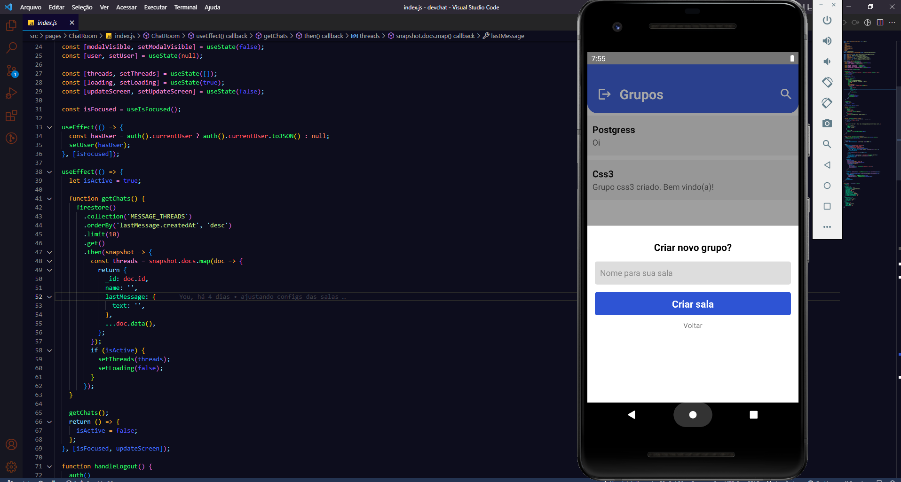

# Dev chat

  

## Objetivo:

### Criar um aplicativos de grupos similar ao telegram onde possibilite os usuários conversar em tempo real.

## Descrição:

- `Criação e autenticação dos usuários via firebase.`
- `Manipulação do firestore database para armazenamento das conversas.`
- `Somente usuário logados podem criar grupos.`
- `Cada usuário fica limitado a criar somente 4 grupos.`
- `Somente o criador do grupo consegue deletar o mesmo.`
- `Pesquisa de grupos pelo título.`
- `Bate papo em tempo real.`

## <i>Douglas Monteiro</i> 😁🔥🚀
